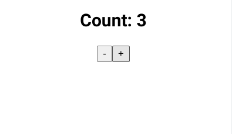

# SSR Example - React 17

# Overview



I am looking back over React techniques as I prepare to transition to React 18.  This [tutorial](https://www.youtube.com/watch?v=NwyQONeqRXA) is a simple example of the process of server side rendering in React.  I found a great [blog](https://blog.saeloun.com/) in the course of looking at this topic in React.  I hope to do something more involved in React with server side rendering in the future.  

## How To Use

To clone and run this application, you'll need [Git](https://git-scm.com) and [Node.js](https://nodejs.org/en/download/) (which comes with [npm](http://npmjs.com)) installed on your computer. From your command line:

```bash
# Clone this repository
$ git clone https://github.com/jdegand/ssr-example

# Install dependencies
$ npm install

# Run the app
$ npm run build
$ npm run ssr
```

### Useful Resources

- [YouTube](https://www.youtube.com/watch?v=NwyQONeqRXA) - SSR Tutorial
- [Blog](https://blog.saeloun.com/2021/12/16/hydration) - Hydration
- [Github](https://github.com/reactwg/react-18/discussions/37) - React 18 SSR
